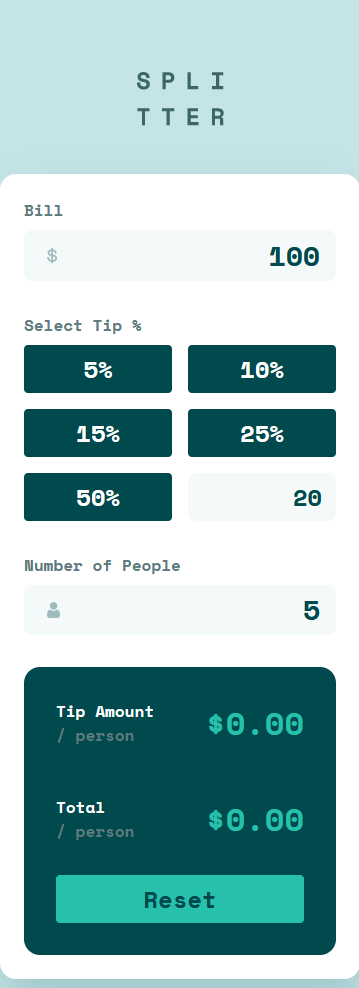
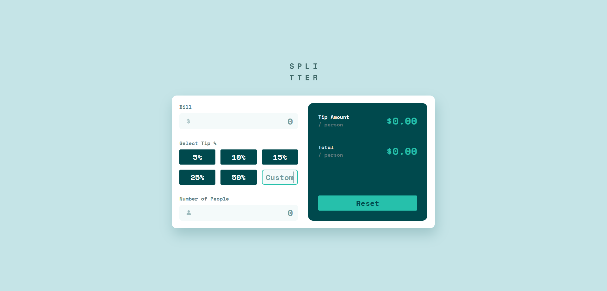

# Frontend Mentor - Tip calculator app solution

This is a solution to the [Tip calculator app challenge on Frontend Mentor](https://www.frontendmentor.io/challenges/tip-calculator-app-ugJNGbJUX). Frontend Mentor challenges help you improve your coding skills by building realistic projects.

## Table of contents

- [Frontend Mentor - Tip calculator app solution](#frontend-mentor---tip-calculator-app-solution)
  - [Table of contents](#table-of-contents)
  - [Overview](#overview)
    - [The challenge](#the-challenge)
    - [Screenshot](#screenshot)
      - [mobile](#mobile)
      - [desktop](#desktop)
  - [My process](#my-process)
    - [Built with](#built-with)
    - [What I learned](#what-i-learned)
    - [Continued development](#continued-development)

## Overview

### The challenge

Users should be able to:

- View the optimal layout for the app depending on their device's screen size
- See hover states for all interactive elements on the page
- Calculate the correct tip and total cost of the bill per person

### Screenshot

#### mobile



#### desktop



## My process

### Built with

- Semantic HTML5 markup
- CSS custom properties
- Flexbox
- CSS Grid

### What I learned

I learned more about styling inputs and being able to change focus.

```css
input {
  border: 2px solid transparent;
  background-color: var(--light-grayish-cyan);
  background-repeat: no-repeat;
  background-position: center left 0.75em;
  padding: 0.1em 0.5em;
  border-radius: 8px;
  text-align: right;
  font-family: inherit;
  font-size: 28px;
  color: var(--very-dark-cyan);
}

input:focus {
  outline: none !important;
  border-color: var(--strong-cyan);
}

input[type="number"] {
  appearance: textfield;
}
}
```

It was the first time in awhile that touched Javascript for the front-end, so I was able to recount how to read and manipulate the DOM, add listener events and implemment type conversions.

```js
// get value of input
let bill = $(".bill").val();

// add listener on element
$(".tip--custom").on("keyup", function () {
  tip = $(".tip--custom").val();
  $("button").removeClass("selected");
  calculateTip();
});

// change element text
$(".tip-result").text(`$${tipResult}`);
$(".bill-result").text(`$${billResult}`);
```

### Continued development

I am getting a lot better at responsive design and it turns out that it's pretty easy. I also implemented an angular version of this app to just remember what I've learnt at uni and get used to understanding how front-end frameworks work. I find that it is quite challenging at the moment to manipulate the DOM using a framework, so I plan to dive further into it. I want to get to know React and how to create components, especially knowing when to create one. I think one of my key focus in using a front-end framework is how to share data between components to change states.
