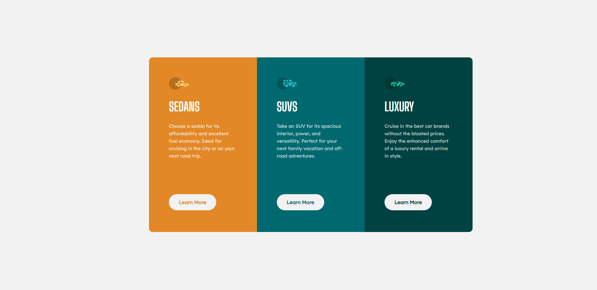

# Frontend Mentor - 3-column preview card component solution

## Table of contents

- [Frontend Mentor - 3-column preview card component solution](#frontend-mentor---3-column-preview-card-component-solution)
  - [Table of contents](#table-of-contents)
  - [Overview](#overview)
    - [The challenge](#the-challenge)
    - [Screenshot](#screenshot)
  - [My process](#my-process)
    - [Built with](#built-with)
    - [What I learned](#what-i-learned)
    - [Continued development](#continued-development)
    - [Useful resources](#useful-resources)

## Overview

### The challenge

Users should be able to:

- View the optimal layout depending on their device's screen size
- See hover states for interactive elements

### Screenshot



## My process

### Built with

- Semantic HTML5 markup
- CSS custom properties
- CSS Grid

### What I learned

Learnt the best way to center a div with the least about of lines.

```css
.container {
  display: grid;
  place-items: center;
}
```

The previous ways that I've done this is by the two following css extracts:

```css
// Method 1
.container {
  position: absolute;
  top: 50%;
  left: 50%;
  transform: translate(-50%, -50%);
}

// Method 2
.container {
  display: flex;
  justify-content: center;
  align-items: center;
}
```

I must remember how to use the transition property in css when transitioning more than 1 property. In such case each property must be separated by a comma and specify the transition duration for all of them.

```css
.button {
  transition: background-color 0.5s, color 0.5s;
}
```

A better way to do this to avoid repetitiveness is this following:

```css
.button {
  transition-property: background-color color;
  transition-duration: 0.5s;
}
```

### Continued development

I have to yet implement responsive design using media queries and the clamp function, however, I am first building up a foundation in my ability to place content onto a webpage using the least amount of lines and minimising repetitiveness. I think starting off with grid and flexbox to take care of some of the responsiveness of a webpage for now is appropriate. Once I am able to build commonly used website components with some ease, I will put more focus on improving my knowledge in responsive design.]

For now, my attention is best placed in the following:

- specifying acceptable margin space for certain elements to promote consistency across the website when reusing those elements
- ability to take advantage of grid and flexbox's flexibilities in creating distinct designs
- setting a standard for h1 and p elements as a way to also promote consistency. This should be the font-family, font-size, font-weight and line-height. It's time to research more into the best practices of utilising relative sizing between elements.
- understand the best practices in sizing containers.

### Useful resources

- [Top 3 Ways to Center a DIV with CSS](https://www.youtube.com/watch?v=njdJeu95p6s&ab_channel=Fireship) - This helped me in discovering in what ways I can center a div and choosing the best way to do so. This topic is commonly searched on Stack Overflow, but there are too many differing opinions. I like the grid method since it's straightforward, simple and complaint-free.
