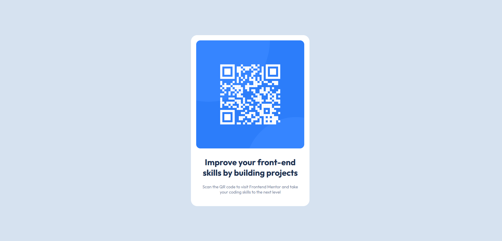

# Frontend Mentor - QR code component solution

This is a solution to the [QR code component challenge on Frontend Mentor](https://www.frontendmentor.io/challenges/qr-code-component-iux_sIO_H). Frontend Mentor challenges help you improve your coding skills by building realistic projects.

## Table of contents

- [Frontend Mentor - QR code component solution](#frontend-mentor---qr-code-component-solution)
  - [Table of contents](#table-of-contents)
  - [Overview](#overview)
    - [Screenshot](#screenshot)
      - [Mobile](#mobile)
      - [Desktop](#desktop)
  - [My process](#my-process)
    - [Built with](#built-with)
    - [What I learned](#what-i-learned)
      - [min()](#min)
      - [clamp()](#clamp)
    - [Continued development](#continued-development)
    - [Useful resources](#useful-resources)

**Note: Delete this note and update the table of contents based on what sections you keep.**

## Overview

### Screenshot

#### Mobile


#### Desktop



## My process

### Built with

- Semantic HTML5 markup
- CSS custom properties
- Flexbox
- CSS Grid
- Mobile-first workflow
- [React](https://reactjs.org/) - JS library
- [Next.js](https://nextjs.org/) - React framework
- [Styled Components](https://styled-components.com/) - For styles

**Note: These are just examples. Delete this note and replace the list above with your own choices**

### What I learned

In this challenge I focused more on responsive design with the strategy of completing the mobile design first before moving to desktop.

I used this opportunity to understand the min() and clamp() functions to resize containers and font sizes.

#### min()

```css
.container {
  width: min(90%, 28.25rem);
}

// this is exactly the same as
.container {
  width: 90%;
  max-width: 28.25rem;
}
```

#### clamp()

```
p {
  font-size: clamp (12px, 2.5vw, 20px);
}

```

### Continued development

I will maintain a focus on responsive design, but also begin to play my hand at further understanding grid css, as I have not had many opportunities at the moment to play arond with besides a very old project.
For responsive design, i would like to do more research on how to keep the site responsive in the presence of multiple components.

### Useful resources

- [min() and clamp() functions](https://www.youtube.com/watch?v=U9VF-4euyRo&t=0s&ab_channel=KevinPowell) - Kevin Powell is a great guide for mastering css and responsive design. Many of his videos have helped me to see significant improvements from one project to the next. I will using his clear explanations for future challenges.
