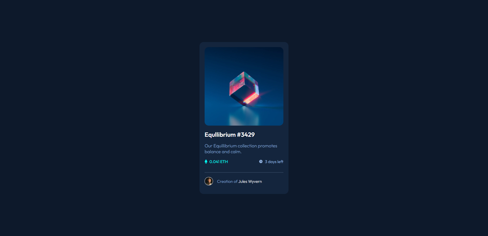

# Frontend Mentor - NFT preview card component solution

This is a solution to the [NFT preview card component challenge on Frontend Mentor](https://www.frontendmentor.io/challenges/nft-preview-card-component-SbdUL_w0U). Frontend Mentor challenges help you improve your coding skills by building realistic projects.

## Table of contents

- [Overview](#overview)
  - [The challenge](#the-challenge)
  - [Screenshot](#screenshot)
  - [Links](#links)
- [My process](#my-process)
  - [Built with](#built-with)
  - [What I learned](#what-i-learned)
  - [Continued development](#continued-development)
  - [Useful resources](#useful-resources)
- [Author](#author)
- [Acknowledgments](#acknowledgments)

**Note: Delete this note and update the table of contents based on what sections you keep.**

## Overview

### The challenge

Users should be able to:

- View the optimal layout depending on their device's screen size
- See hover states for interactive elements

### Screenshot

Add a screenshot of your solution. The easiest way to do this is to use Firefox to view your project, right-click the page and select "Take a Screenshot". You can choose either a full-height screenshot or a cropped one based on how long the page is. If it's very long, it might be best to crop it.

Alternatively, you can use a tool like [FireShot](https://getfireshot.com/) to take the screenshot. FireShot has a free option, so you don't need to purchase it.

Then crop/optimize/edit your image however you like, add it to your project, and update the file path in the image above.

**Note: Delete this note and the paragraphs above when you add your screenshot. If you prefer not to add a screenshot, feel free to remove this entire section.**

### Links

- Solution URL: [Add solution URL here](https://your-solution-url.com)
- Live Site URL: [Add live site URL here](https://your-live-site-url.com)

## My process

Basically learning css from scratch, so much of this challenge involved me putting what I've learnt about flexbox into practice.
I started off my separating the different components there was in creating the card.

1. We need a flexbox container to perfectly centre the card in the middle of the viewport. This was accomplished using the justify-content and align-items properties. This container also needed to fill the entire page, so I found out the best way to do this was {position: absolute; top: 0; bottom: 0; right: 0; left: 0;}
2. I then separated the card into the following parts:

- card image
- card description
- card/subject details
- creator info
  These used a lot of what I learnt about flexbox to easily organise the positioning of the elements, such as using spread to put eth and day left at either ends of the card row

## Improvements

I still need to develop my ability to optimise my css, ensuring that my selectors created aren't overly specific to reduce repetitiveness.
I also need to be able to utilise more css functions and attributes to accomplish the desired design to improve readability.
All it is right now is to keep learning and apply the best practices.

### Built with

- Semantic HTML5 markup
- CSS custom properties
- Flexbox
